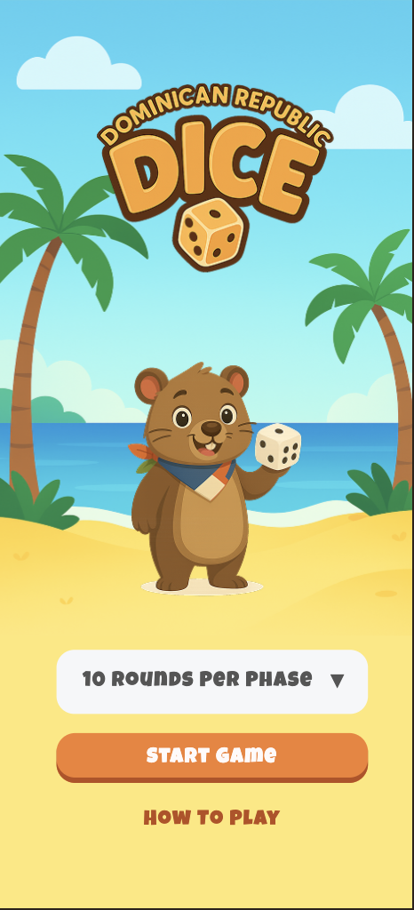
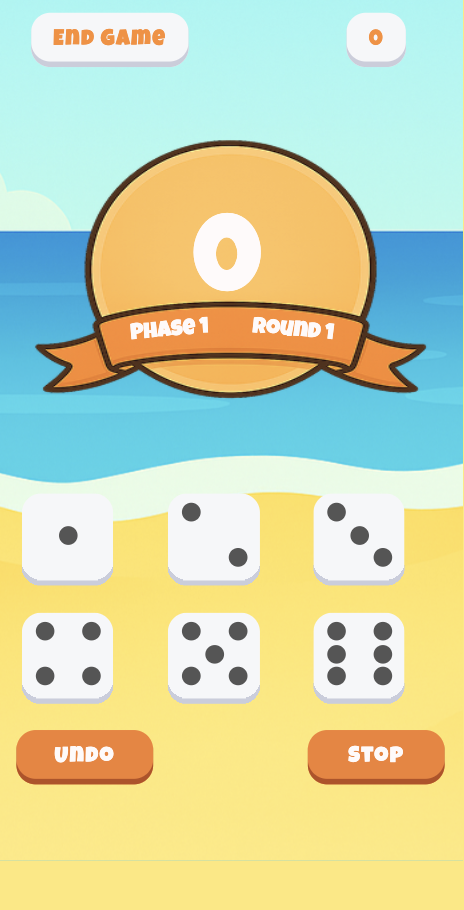
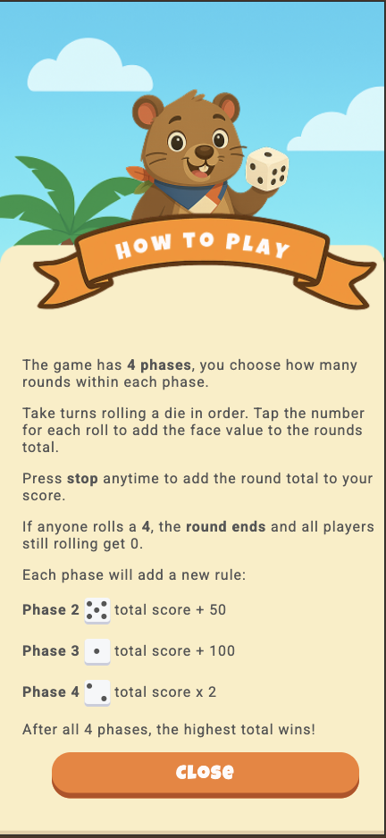
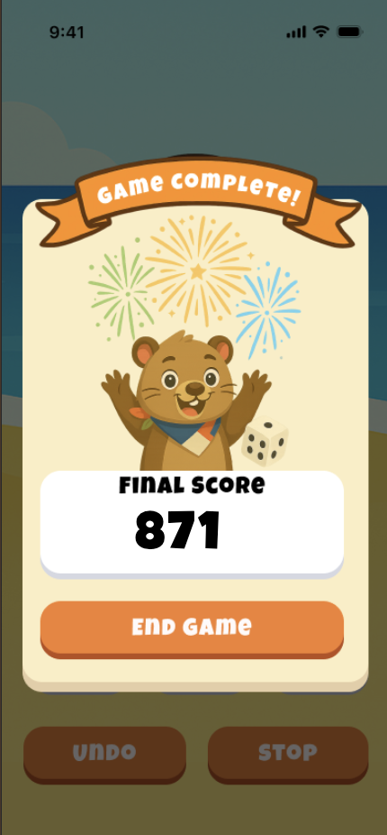

# 🎲 Dominican Dice

A fun and engaging dice game inspired by Dominican culture, built with vanilla HTML, CSS, and JavaScript. Test your luck and strategy across 4 challenging phases!


## 📋 Table of Contents
- [About](#about)
- [Features](#features)
- [Game Rules](#game-rules)
- [Screenshots](#screenshots)
- [Tech Stack](#tech-stack)
- [Project Structure](#project-structure)
- [Getting Started](#getting-started)
- [Gameplay](#gameplay)
- [Responsive Design](#responsive-design)

## 🎮 About

Dominican Dice is a single-player dice rolling game where players navigate through 4 increasingly challenging phases. Each phase introduces new scoring rules and opportunities to maximize your points. The game features a beautiful tropical beach theme with custom graphics and a fully responsive mobile-first design.

## ✨ Features

- **4 Unique Phases** - Each phase adds new scoring mechanics
- **Customizable Rounds** - Choose 5, 10, or 15 rounds per phase
- **Strategic Gameplay** - Decide when to stop rolling to maximize your score
- **Beautiful UI** - Custom graphics and animations
- **Fully Responsive** - Optimized for all mobile devices
- **No Dependencies** - Built with vanilla JavaScript, no frameworks needed
- **Modal Transitions** - Visual indicators when advancing to new phases
- **Score Tracking** - Keep track of your total and round scores

## 📖 Game Rules

### Basic Rules
1. The game consists of **4 phases** with a configurable number of rounds per phase (5, 10, or 15)
2. Players take turns rolling dice and tapping each die to add its value to the round total
3. Press **Stop** at any time to add your round total to your overall score
4. **Warning**: If anyone rolls a **4**, the round ends immediately and all players still rolling get 0 points!

### Phase Bonuses
- **Phase 1**: No bonuses - just accumulate points
- **Phase 2**: Roll a 5️⃣ → Add 50 points to total score
- **Phase 3**: Roll a 1️⃣ → Add 100 points to total score  
- **Phase 4**: Roll a 2️⃣ → Multiply total score by 2

### Strategy Tips
- Know when to stop rolling to avoid the dreaded 4
- Save high rolls for later phases when bonuses are active
- Balance risk vs. reward in each round

## 📸 Screenshots

### Landing Page
The game starts with an attractive landing page featuring the Dominican Dice logo and mascot (Hutia). Players can select their preferred number of rounds per phase.



### Game Screen
The main game interface displays the current phase, round, round score, and total score on a tropical scoreboard. Six dice buttons allow players to roll and accumulate points.



### Phase Transitions
When advancing to a new phase, a modal displays the phase number and introduces new scoring rules.


### How to Play
A comprehensive instructions page explains all game rules and phase bonuses with visual examples.



### Game End
After completing all 4 phases, players see their final score on a custom end-game screen.



## 🛠 Tech Stack

- **HTML5** - Semantic markup
- **CSS3** - Custom styling with:
  - CSS Grid for layouts
  - Flexbox for component alignment
  - Responsive design using `clamp()` and viewport units
  - Custom animations and transitions
- **JavaScript (ES6+)** - Game logic including:
  - Score calculations
  - Phase progression
  - Round management
  - Modal controls
  - Session storage for game state

## 📁 Project Structure

```
Code-Camp-2025/
│
├── assets/                     # All game graphics
│   ├── DomingoBanner.png      # Header banner
│   ├── beach.svg              # Background for game page
│   ├── beachTree.svg          # Background for landing page
│   ├── final.png              # End game screen background
│   ├── howto.png              # How to play page background
│   ├── hutia.png              # Mascot image
│   ├── logo.png               # Game logo
│   ├── phase1.png             # Phase 1 modal image
│   ├── phase2.png             # Phase 2 modal image
│   ├── phase3.png             # Phase 3 modal image
│   ├── phase4.png             # Phase 4 modal image
│   └── scoreBubble.png        # Score display background
│
├── landing/                    # Landing page
│   ├── landing.html           # Landing page markup
│   ├── landing.css            # Landing page styles
│   └── landing.js             # Round selection logic
│
├── game/                       # Main game
│   ├── game.html              # Game interface markup
│   ├── game.css               # Game styles
│   └── game.js                # Core game logic
│
├── howtoplay/                  # Instructions
│   ├── howtoplay.html         # Instructions markup
│   └── howtoplay.css          # Instructions styles
│
└── index.html                  # Root file (redirects to landing)
```

## 🚀 Getting Started

### Prerequisites
- A modern web browser (Chrome, Firefox, Safari, Edge)
- No build tools or dependencies required!

### Installation

1. Clone the repository:
```bash
git clone https://github.com/janjo12/Code-Camp-2025.git
cd Code-Camp-2025
```

2. Open the game:
   - Simply open `index.html` in your web browser, or
   - Use a local development server (optional):
   ```bash
   # Using Python
   python -m http.server 8000
   
   # Using Node.js
   npx http-server
   ```

3. Start playing! 🎲

## 🎯 Gameplay

1. **Start**: Select your preferred rounds per phase (5, 10, or 15) on the landing page
2. **Roll**: Click the dice buttons to roll and add values to your round score
3. **Stop**: Press the "Stop" button to bank your round score
4. **Undo**: Made a mistake? Use the "Undo" button to reverse your last roll
5. **Progress**: Complete all rounds in each phase to advance
6. **Win**: Finish all 4 phases and see your final score!

## 📱 Responsive Design

Dominican Dice is built with a **mobile-first** approach and is fully responsive across all device sizes:

- **Viewport Lock**: Prevents zooming and unwanted scrolling on mobile
- **Fluid Typography**: Text scales smoothly using `clamp()` functions
- **Flexible Layouts**: CSS Grid and Flexbox ensure proper alignment
- **Touch-Optimized**: Large tap targets for mobile users
- **Adaptive Images**: Graphics scale proportionally with screen size
- **Vertical Responsiveness**: Uses viewport height (vh) units for optimal vertical spacing

### Tested On
- iPhone SE to iPhone Pro Max
- Android devices (various sizes)

## 🎨 Design Features

- **Custom Typography**: "Luckiest Guy" font for headers, "Roboto" for body text
- **Tropical Theme**: Beach and palm tree backgrounds
- **Color Palette**: Warm oranges (#F3802F) and sunny yellows (#fee876)
- **Smooth Animations**: Hover effects and transitions throughout
- **Modal Dialogs**: Clean phase transition screens
- **Visual Feedback**: Clear score displays and game state indicators

## 🤝 Contributing

This project was created as part of Code Camp 2025. Feel free to fork and customize for your own use!

## 📝 License

This project is open source and available for educational purposes.

## 🎉 Credits

- **Design & Development**:
    * **Joseph Hunt**: Developer, core logic
    * **Christie Gerritsen**: Developer, architecture and UI implementation
    * **Haylee McArthur**: UI/UX Designer, wireframing, visual design, user experience flows
- **Mascot**: Dominican Hutia (Plagiodontia aedium)
- **Theme**: Inspired by Dominican Republic culture

---

**Enjoy playing Dominican Dice! 🎲🌴**

*Happy rolling!*
